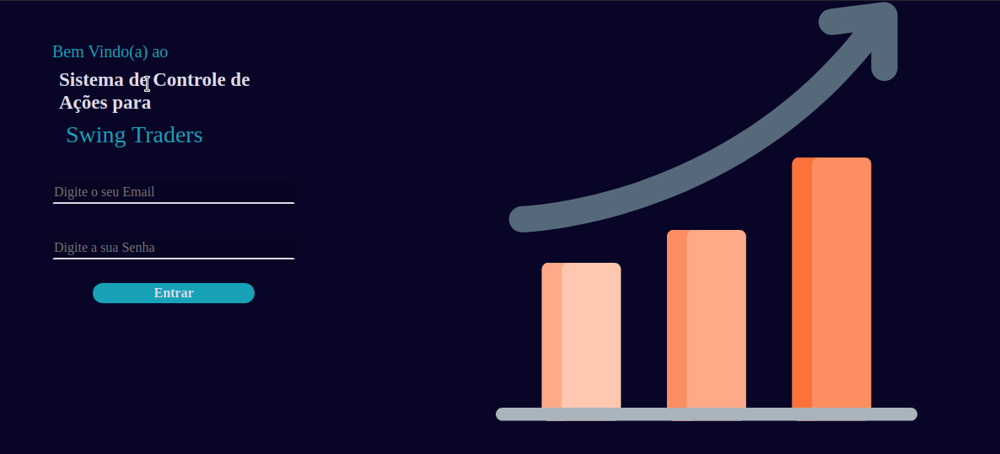
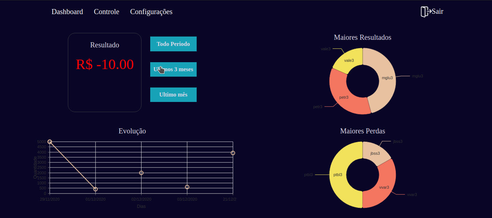
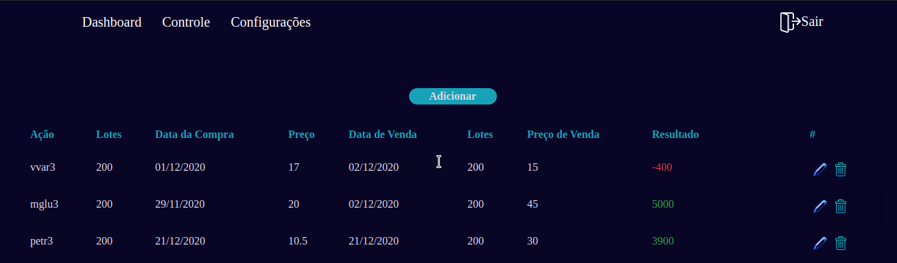

# Swing Trader

Sistema web com foco em gerenciar de forma simples e eficaz as operações do tipo Swing Trade no mercado de ações, disponibilizando a tabela de controle na qual ja realiza o calculo de resultados e dando, no dashboard, uma visão detalhada dos resultadso e evoluções.

Web system focused on managing Swing Trade operations in the stock market in a simple and effective way, providing the control table in which it already calculates results and giving, in the dashboard, a detailed view of the results and developments.

## Illustration

## Built With

* [React Hooks](https://pt-br.reactjs.org/docs/hooks-reference.html) - The web library used
* [NodeJS](https://nodejs.org/en/docs/es6/) - Web Application Backend
* [Typescript](https://www.typescriptlang.org/docs/) - Development Tool
* [MongoDB](https://docs.mongodb.com/) - Database

## Authors

* **Victor Guedes ** 